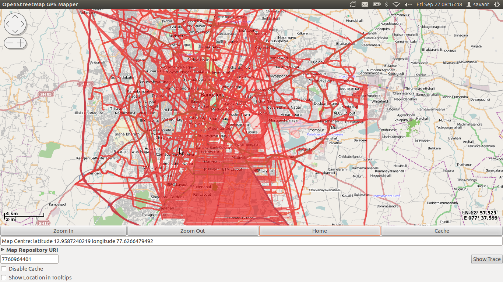

# Traffic Analysis Project

## Introduction

As part of B.Tech Project (EE491) I'm working under [Prof. D. Manjunath](http://www.ee.iitb.ac.in/~dmanju/). The project is in collaboration with [Mr. V. Navda](http://research.microsoft.com/en-us/people/navda/) from Microsoft Research

## Using the Data

The data has been provided by Trinity Mobility Pvt Ltd.

The xlsx files for each day containing the traces are first converted into csv format for easier handling, using the tool [xlsx2csv](http://github.com/dilshod/xlsx2csv)

The csv data can then be imported into internal python class data specifid in gpstraces.py

The wrapper trinity\_gpsdataset.py provides an abstraction over the data providing methods to filter it or get a part of the data

## Rendering

OpenStreetMaps data is used for visualization
A library [osm-gps-map](https://github.com/nzjrs/osm-gps-map) is used to render map data and the trace

An example trace for one day is shown below.

